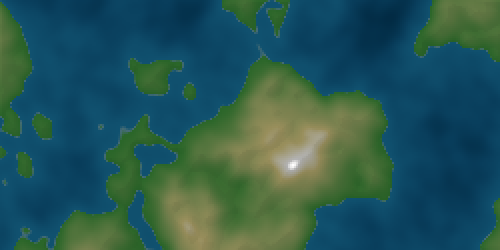

# Noise Map

 A procedural 2D map generator based on Perlin / simplex noise

## Example



## Usage

Create a `Canvas` in your HTML code:

```html
<canvas id="map-canvas" width="800" height="400"></canvas>
```

Create a `HeightMap` with the `MapGenerator` in your JS code:
```js
var NoiseMap = require('noise-map');

var generator = new NoiseMap.MapGenerator();
var heightmap = generator.createMap(400, 200, {type: 'perlin'});

var context = document.getElementById('map-canvas').getContext('2d');
heightmap.draw(context, 800, 400, 'real');
```

## API


## Installation

You can install the module with [npm](https://www.npmjs.com/):
```sh
npm install noise-map
```

You can import the module with [unpkg](https://unpkg.com/):
```html
<script type="text/javascript" src="https://unpkg.com/noise-map@latest"></script>
```

You can clone the repository & include the `noise-map.js` file in your project:
```sh
git clone https://github.com/ogus/pixel-jump.git
```


## License

This project is licensed under the WTFPL - see [LICENSE](LICENSE) for more details
